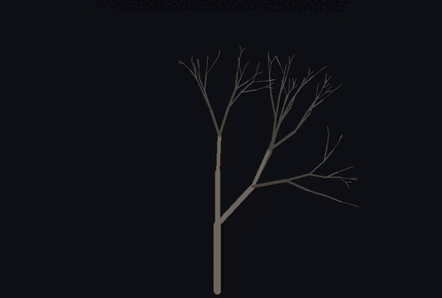

# Tree generator

# un arbol que crece.

Un pequeño experimento de generación procedural hecho en Python + Tkinter.

El programa genera y anima un árbol mediante ramas creadas recursivamente,
con pequeñas variaciones aleatorias para evitar que cada árbol sea perfectamente simétrico.

No intenta ser un simulador botánico. La idea era simplemente conseguir
un árbol que pareciera suficientemente natural sin dibujar sus ramas manualmente.

## ¿Cómo funciona?

El árbol se genera mediante una función recursiva.

Cada rama contiene información como:

- posición inicial
- posición final
- ángulo
- longitud
- grosor
- momento en el que comienza a crecer

Cuando se genera una rama, se crean nuevas ramas a partir de su extremo.

En cada generación se aplican pequeñas variaciones aleatorias:

- el ángulo cambia
- la longitud disminuye
- el grosor disminuye
- el número de ramas puede variar

Esto evita que el árbol tenga una estructura completamente simétrica.

no se que mas agregar.
:b
adios.

